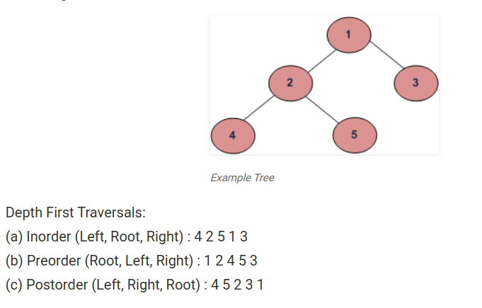

## Summer 2019

----
Keep track of the leetcode problems solved throughout the summer. The priority is on the Facebook tagged ones.

>
><span style="font-family:Papyrus; color:red; font-size:4em;">Number of Leetcode Problems Solved: 27 </span>
>


----

Next target: properly prepare a paper for submission to ML/security conference in September. As in October, internship interviews would be flooding in.

****

### Algorithm and Data Structures

  * String and Array Algorithms (07/01/2019 ).

    __P287 Find the Duplicate Number:__
      Pretty basic, warming up the syntax and use both brute force, set and sorting solution.

    __P280 Wiggle Sort:__ Doing careful and patient analysis.


    __P695 Max Area of an Island:__ Review basics on BFS, as well as arrays.

    __P48 Rotate Image:__ Figure out change of indexes for symmetric operations.

  * Arrays Continued: Stocks (07/02/2019)

    __P665 Non-decreasing Array:__ I would not classify it as _easy_.

    __P88 Merge Sorted Array:__ Rather strange problem.

    __P189 Rotate Array:__ Could not find the approach with $O(1)$ space complexity.

    __P11 Container with Water:__ Checked discussion. Consider two pointer approach. An excellent article on this problem can be found [here](https://leetcode.com/articles/container-with-most-water/).

  * Arrays Continued (07/03/2019).
    ```diff
    - Date Night!
    ```

  * Arrays Continued (07/04/2019).

    __P792 Number of Matching Subsequences:__ Still encountering time limit errors after optimization.

    __P162 Find Peak Element:__ Rather strange problem.

    __P80 Remove Duplicates from Array:__ Another rather strange one.

    __P73 Set Matrix Zeros:__ Routine.

    __P238 Product of Array Except Itself:__ Place VS Time complexity.

  * Arrays Continued: Sub arrays. (07/08/2019)

    __P52 Maximum Subarray:__ Definitely not an easy problem. Involving DP.

    __P152 Maximum Product Subarray:__ Similar to P52.

    __P643 Maximum Avarge Subarray:__

  * Arrays Continued: Last day for arrays. Tomorrow we move onto Binary Tree and Binary Search.

    __P560: Subarray Sum Equals K:__ I was interviewed with this problem for my FB internship.

    Work with cumulative sum seem to be the simplest solution.
    ```python
    class Solution:
    def subarraySum(self, nums: List[int], k: int) -> int:
        # this was my problem during FB interview
        cSum = {}
        cSum[0] = 1
        count,tmp = 0,0
        for i in range(len(nums)):
            tmp += nums[i]
            if tmp-k in cSum:
                count += cSum[tmp-k]
            if tmp in cSum:
                cSum[tmp]+=1
            else:
                cSum[tmp] = 1
        return count
    ```

    __P974: Subarray divisible by K:__ Work out the brute force solution first.

    __P713: Subarray Product Less Than K:__ This is an interesting one. Keep in mind we have positive intergers inside the array. In practice, we should never do cumulative multiplication/division on long vectors.

    __P209 Minimum Length Subarray:__ This is more about designing elegant conditions for efficient coding.


  * Summary of Arrays and Subarrays:

      a. For problems with continuous sub arrays with maximum or minimum, defining ```maxEndingHere``` and ```maxSoFar``` to properly iterating thorugh the array.

      b. If input is positive continuous integers, this is a sign for considering the _two pointer_ approach. Make sure you can write a correct, efficient version of two pointers.

      c. ```prefix-sum``` and ```hashmaps``` are quite powerful when searching or counting subarrays with certain properties.

      d. random testing


  * Tree (07/10/2019): All Types of Traversals

    __P589 N-ary Tree Preorder Traversal__

    __P590 N-ary Tree Postorder Traversal__

    __P429 N-ary Tree Level Order Traversal__

    __P102 Level Order Traversal of Binary Tree__

    Summary: get familiar with recursive and iterative solutions.

    


  * Tree (07/11/2019): Trees Continued

    __P230 Kth Largest Element in BST__

    __P98 Validate Binary Search Tree__

    __P129 Sum Root to Leaf Numbers__

    Summary: we see the power of traversals. Any problem that requires going through the entire tree, should find a solution from one of its traversals. Often, clever recursion can make tree problems much much easier.

  * Tree (07/12/2019): Period!

  * Tree (07/13/2019) continued.

    __P257__ Binary Tree Path

    __P543 Diameter of Binary Tree__

  * Tree (07/15/2019): Continued

    __P687 Longest Univalue Path:__ I was having trouble with `path` for trees.

    ____

    __P173 Binary Search Tree Iterator:__ Let's solve the problem independently, and then have a discussion about the stack approach.

    __P236 Lowest Common Ancestor of a Binary Tree__


  * Stocks (07/05/2019)


    __P121 Best Time to Buy and Sell a Stock:__ Practice two pointers for stock type of problems.

    __P122 Best Time to Buy and Sell a Stock II:__
    ```python
    def profit(prices: List[int])->int:
      profit = 0
      for i in range(len(prices)-1):
        profit = profit + max( 0, prices[i+1]-prices[i] )
        return profit
    ```
    This solution is not exactly intuitive.

    * Dynammic Programming (For Later)

      __P718 Maximum Lenght of Repeated Subarray:__
